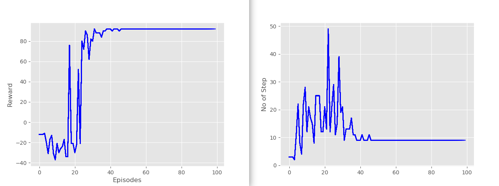

# Autonomous Navigation of MAVs using Reinforcement Learning algorithms

This ROS Package contains the simulation source code for implementing reinforcement learning aglorithms for autonomous navigation of MAVs in indoor environments.

### Dependencies
- Install OpenAI gym
```
sudo pip install gym
sudo apt-get install python-skimage
sudo pip install h5py
pip install tensorflow-gpu (if you have a gpu if not then just pip install tensorflow)
sudo pip install keras
```
- Install <a href="https://github.com/ethz-asl/rotors_simulator">RotorS simulator</a> package:
```
cd ~/catkin_ws/src
git clone git@github.com:ethz-asl/rotors_simulator.git
```
- Clone this package:
```
git clone https://github.com/YugAjmera/rl_mav_ros
cd ..
catkin_make
```

### Q-Learning
- State: Discrete(X,Y Coordinate obtained from generic odometry sensor).
- Action: Forward, Back, Left, Right.
- Space: 5x5 grid space.
- Goal: [4,5]


```
roslaunch rl_mav_ros world.launch
roslaunch rl_mav_ros start_qlearning.launch
```
<p align= "center">

</p>


- Results:
   * alpha = 0.8 (learning rate) 
   * gamma = 0.9 (discount factor) 
   * epsilon = 0.1 (𝜖 -greedy action selection)  <br />
   * Results after learning 100 episodes: The agent learns after about 50 episodes and then always complete the episode in 8 steps with the optimal reward of 92. <br />
    <br />


### References
- <a href="https://github.com/erlerobot/gym-gazebo">gym_gazebo</a> package
- <a href="http://wiki.ros.org/openai_ros">openai_ros</a> package

