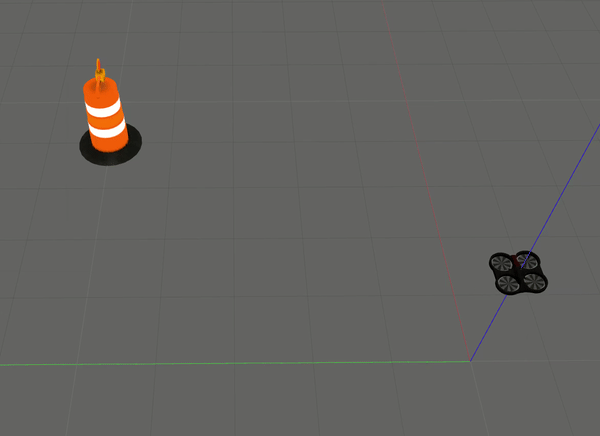

# Autonomous Navigation of MAVs using Reinforcement Learning algorithms

ROS Package to implement reinforcement learning aglorithms for autonomous navigation of MAVs in indoor environments. A PID algorithm is employed for position control.

### Dependencies
- Install OpenAI gym and <a href="https://github.com/erlerobot/gym-gazebo">gym_gazebo</a> package:
```
sudo pip install gym
sudo apt-get install python-skimage
sudo pip install h5py
pip install tensorflow-gpu (if you have a gpu if not then just pip install tensorflow)
sudo pip install keras

cd ~
git clone https://github.com/erlerobot/gym-gazebo
cd gym-gazebo
sudo pip install -e .
```
- Ardrone simulation: 
```
git clone https://github.com/YugAjmera/quadrotor_ros
```

- Clone this package:
```
git clone https://github.com/YugAjmera/rl_mav_ros
cd ..
catkin_make
```

### Environment
- State: Discrete(X,Y Coordinate obtained from generic odometry sensor).
- Action: Forward, Back, Left, Right.
- Space: 5x5 grid space.
- Goal: [4,5]
- Reward: -1 at each step, -10 if the MAV goes out of limits and +100 when the MAV reaches the goal state.
- Parameters: <br />
   * alpha = 0.8 (learning rate) 
   * gamma = 0.9 (discount factor) 
   * epsilon = 0.1 (𝜖 -greedy action selection)  

<p align= "center">

</p>

### Q-learning

```
roslaunch rl_mav_ros world.launch
roslaunch rl_mav_ros start_qlearning.launch
```


### Sarsa
```
roslaunch rl_mav_ros world.launch
roslaunch rl_mav_ros start_sarsa.launch
```


### Expected-Sarsa
```
roslaunch rl_mav_ros world.launch
roslaunch rl_mav_ros start_expected_sarsa.launch
```


### References
- <a href="http://wiki.ros.org/openai_ros">openai_ros</a> package
- Pham, Huy X., et al. <a href="https://arxiv.org/abs/1801.05086">Autonomous uav navigation using reinforcement learning.</a> arXiv preprint arXiv:1801.05086 (2018)
